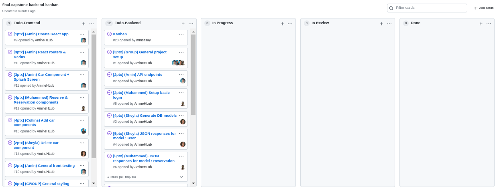
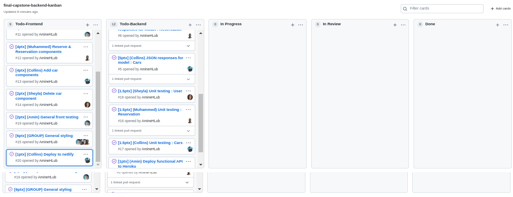

# Backend Final capstone project 🤍 

## Description:

The project is used for project where a user can rent a flat. The endpoints gives opportunity to a user to add and delete flats. Make reservation for a flat and remove it.

[Link to Front end Project Repo](https://github.com/AmineHLub/Cars-Frontend)
[API Documentation](https://blooming-meadow-49781.herokuapp.com/api-docs/index.html)
[Frontend Live Demo Link](https://622110fecccae53070225c23--cars-microverse-cap.netlify.app/)

## Kanban board 
- [Kanban board link](https://github.com/mmsesay/final-capstone-backend/projects/1#card-77937550)

**Initial Kanban**




## Built With

- Ruby on Rails
- PostgreSQL

## Getting Started

To get a local copy up and running follow these simple example steps.

## Instructions

```
$ cd <folder>
```

```
$ git clone git@github.com:mmsesay/final-capstone-backend.git
```

```
$ cd final-capstone-backend
```

## Install

```
$ bundle install
```

## Run

```
$ rails db:create
$ rails db:migrate
```

### Usage

Start server with:

```
$  rails server
```

Open `http://localhost:3000/` in your browser.

## Authors

👤 **Sheyla Pozo** 

- Github:[Sheyla Pozo](https://github.com/sheylaPozo)
- Linkedin: [Sheyla Pozo](https://www.linkedin.com/in/sheypozo/)
- Twitter: [Sheyla Pozo](https://twitter.com/sheyPozo)

👤 **Mohamed Amine**

- GitHub: [@AmineHLub](https://github.com/AmineHLub)
- Twitter: [@Amino47612441](https://twitter.com/Amino47612441)
- LinkedIn: [LinkedIn](https://www.linkedin.com/in/mohamed-amine-hajltaief-b18863163/)

👤 **Muhammad Sesay**

- GitHub: [@mmsesay](https://github.com/mmsesay)
- Twitter: [@DeeMaejor](https://twitter.com/DeeMaejor)
- LinkedIn: [LinkedIn](https://linkedin.com/in/muhammad-m-sesay)

👤 **Makungong Collins Tatang**
- GitHub: [@CollinsTatang1](https://github.com/CollinsTatang)
- Twitter: [@CollinsTatang1](https://twitter.com/CollinsTatang1)
- LinkedIn: [Makungong Collins](https://www.linkedin.com/in/makungong-collins/)

## 🤝 Contributing

Contributions, issues, and feature requests are welcome!

Feel free to check the [issues page](https://github.com/mmsesay/final-capstone-backend/issues).

## Show your support

Give a `⭐️` if you like this project!

## Acknowledgments

- Microverse

* How to run the test suite

* Services (job queues, cache servers, search engines, etc.)

* Deployment instructions
